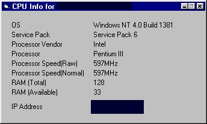

## Get System Info

### Description

This code will quickly tell you a lot of your system information like computer name, IP address, OS, Service Pack, Processor Vendor, Processor Type, Processor Speed (Raw and Normal), RAM (Total and Available).

The processor speed and RAM are on a timer and are updated every second.

I am using a getcpu.dll that I downloaded of PSC created by Catalin Petolea. I am trying to get the source of the dll, but have not got it yet. The IP address module was also downloaded from PSC. Thanks for leting me use your code.

Please vote if you like it and leave some feedback. We may use this program at work, so if there is any other information you think should be on it, please leave feedback or email me at rossim@jitzs.com.
 
### More Info
 

             |
---                |---
**Submitted On**   |2001-04-10 09:19:42
**By**             |[N/A](https://github.com/Planet-Source-Code/PSCIndex/blob/master/ByAuthor/empty.md)
**Level**          |Advanced
**User Rating**    |4.1 (29 globes from 7 users)
**Compatibility**  |VB 5\.0, VB 6\.0
**Category**       |[Windows API Call/ Explanation](https://github.com/Planet-Source-Code/PSCIndex/blob/master/ByCategory/windows-api-call-explanation__1-39.md)
**World**          |[Visual Basic](https://github.com/Planet-Source-Code/PSCIndex/blob/master/ByWorld/visual-basic.md)
**Archive File**   |[Get System181734102001\.zip](https://github.com/Planet-Source-Code/get-system-info__1-22274/archive/master.zip)

